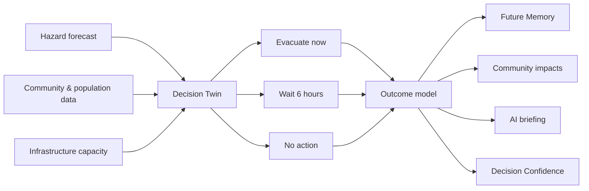

Exit code: 0
Wall time: 0.4 seconds
Output:
# FutureEcho AI

> **See the Future. Change the Outcome.**

[](https://futureecho-ai-igad.ljs2546.chatgpt.site)
[](LICENSE)
[](https://react.dev/)
[](https://www.typescriptlang.org/)

FutureEcho AI is an AI-powered **Decision Twin** for disaster response. Instead of stopping at ?쏻hat is happening??? it helps emergency leaders ask:

> **What happens if we choose a different action?**

Built for the **IGAD Hackathon 2026**.


## Why FutureEcho is different

Most early-warning systems describe one forecast. FutureEcho turns a live hazard into multiple explorable futures:

1. **AI Futures Explorer** ??compare evacuating now, waiting six hours, or taking no action.
2. **Future Memory** ??read a simulated dispatch written from 24 hours ahead.
3. **Outcome Difference** ??compare lives, roads, hospitals, water, agriculture, and economic loss.
4. **Decision Confidence** ??inspect confidence, data sources, assumptions, and uncertainty.
5. **Community impact model** ??see every decision propagate through critical public systems.

The result is a decision platform?봭ot another weather dashboard.

## Screenshots

| Desktop decision explorer | Responsive mobile experience |
|---|---|
|  |  |

## Architecture



The hackathon prototype uses a deterministic in-browser simulation so the demonstration is fast and reliable. Production integration would connect validated ICPAC forecasts, county GIS networks, facility feeds, and locally calibrated impact models.

## Technology

- React 19 and TypeScript
- Vite with vinext
- Tailwind CSS
- Framer Motion
- Lucide icons
- Leaflet-ready mapping layer
- Cloudflare-compatible server output

## Installation

Requirements:

- Node.js 22.13 or newer
- pnpm

```bash
git clone https://github.com/lsh2546/futureecho-ai.git
cd futureecho-ai
pnpm install
```

## Development

```bash
pnpm dev
```

Open the local URL printed in the terminal.

## Production build

```bash
pnpm build
pnpm test
```

The deployment build is emitted to `dist/`.

## Project structure

```text
futureecho-ai/
?쒋??€ app/
??  ?쒋??€ globals.css          # Design system and responsive styles
??  ?쒋??€ layout.tsx           # Metadata and application shell
??  ?쒋??€ loading.tsx          # Accessible loading experience
??  ?붴??€ page.tsx             # Futures Explorer and simulation UI
?쒋??€ build/
??  ?붴??€ sites-vite-plugin.ts # Deployment integration
?쒋??€ db/                      # Optional persistence foundation
?쒋??€ drizzle/                 # Database migration metadata
?쒋??€ public/
??  ?쒋??€ screenshots/         # README and submission screenshots
??  ?붴??€ og.png               # Social preview artwork
?쒋??€ tests/
??  ?붴??€ rendered-html.test.mjs
?쒋??€ worker/
??  ?붴??€ index.ts             # Cloudflare-compatible entrypoint
?쒋??€ LICENSE
?쒋??€ package.json
?붴??€ vite.config.ts
```

## Validation

The current main branch is checked with:

- Production compilation
- Server-rendered product-shell test
- Signature-feature and trust-layer source contract test
- Desktop browser interaction testing
- 375px mobile overflow and responsive-layout testing
- Reduced-motion and keyboard-focus support

## Demo flow

1. Start at the live event and compare all three futures.
2. Select **Wait 6 hours**.
3. Show how Future Memory and Outcome Difference change.
4. Inspect the Decision Confidence evidence chain.
5. Return to **Evacuate now** and close with the tagline.

## Responsible use

All values in this prototype are representative simulation data. FutureEcho provides **decision support, not certainty**. Operational use requires validated data, local calibration, governance, and human authorization.

## License

Distributed under the [MIT License](LICENSE).

